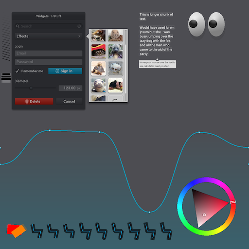

# NanoRT backend for NanoVG



`nanovg-nanort` is a CPU backend using software ray tracer(NanoRT) for Mikko Mononen’s awesome vector graphics renderer NanoVG(https://github.com/memononen/nanovg). 

`nanovg-nanort` does not require OpenGL environment, thus it can draw vector graphics in various environment(e.g. server-side, no-GPU/no-OpenGL machine, virtual machine environment, etc).

In contrast to default OpenGL backend for `NanoVG`, `nanovg-nanort` requires C++(C++-98 + STL) compiler.

## How to use.

Simply copy `src/**` files to your project.
See `example/example_rt.cc` for example.

```
#include "nanovg.h"

// Defined these in *one* .cc
#define NANOVG_RT_IMPLEMENTATION
#define NANORT_IMPLEMENTATION
#include "nanovg_rt.h"

NVGcontext* vg = NULL;

int winWidth = 1024;
int winHeight = 1024;
float pxRatio = 1.0f;

vg = nvgCreateRT(NVG_DEBUG, winWidth, winHeight);
if (vg == NULL) {
	printf("Could not init nanovg.\n");
	return -1;
}

nvgClearBackgroundRT(vg, 0.3f, 0.3f, 0.32f, 1.0f);

nvgBeginFrame(vg, winWidth, winHeight, pxRatio);

// ... call nvg API here as usual ...

nvgEndFrame(vg);

// Grab rendered image
unsigned char* rgba = nvgReadPixelsRT(vg);

//stbi_write_png("render.png",  winWidth, winHeight, 4, rgba, winWidth * 4);

nvgDeleteRT(vg);
```

## TODO

* [ ] Anti-alasing.
* [ ] Robust alpha-blending.
* [ ] Premultiplied alpha validation.
* [ ] Optimization.
  * [ ] Draw call optimization.
  * [ ] Multi-threaded rendering.

## License

`nanovg-nanort` is licensed under zlib license. See `LICENSE.txt` for details.
`NanoVG` is licensed under zlib license.
`NanoRT` is licensed under MIT license.

